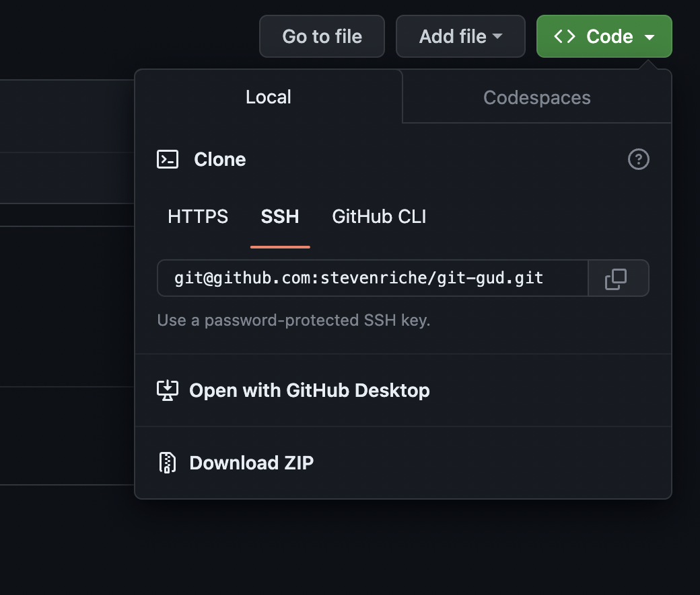

# git-gud
Git Practice

## Some important terms

*Git*: Git is the name of a tool that helps track changes in data. It's probably already installed on your computer. Think of it as a cross between a time-machine (lets you rewind back through changes made to code), a multi-verse explorer (lots of people can make different changes to code at once, and you can jump around between them), and a teleporter (you can immediately see changes someone else made on your own computer, or allow someone else to see your changes). Git primarily is a command line interface (CLI) tool, but there are UI applications you can use like [Sourcetree](https://www.sourcetreeapp.com/) or [Github Desktop](https://desktop.github.com/).

*GitHub*: GitHub is a 3rd party service that runs on Git. Git allows you to move code back and forth, but if you want to share that code with someone, you have to have it hosted in a common place. [Github](https://github.com) is a common service that can do most git-hosting features for free. (Another one is [BitBucket](https://bitbucket.org/)). You don't need to use GitHub to use git - you can just track changes on your own machine - but you will probably need an account with GitHub or a similar service if you want to share your code.

*Repo* or *Repository*: A group of files that are tracked in git together is called a "repo" (or repository). You could have any number of files or folders in a repo, and git will track all the changes to any data in the repo (including file names, folder names, folder structure, etc.). Usually you will see code kept in a repo (since text files are ideal for git), but you'll also often see image files kept as part of a project in git too. Audio and video files are usually too large to be tracked with git.

*Commit*: A commit is like a bookmark or stepping stone when you are looking through the history of a repo. Similarly to saving your progress in your work, you "commit" your changes occasionally to your repo, and you can later use the git commands to rewind/fast-forward to that point in time, or push your changes to another computer.

*Branch*: Git is ideal for having lots of people working on the same code base at once. You can create an endless number of "branches" to code where you make changes or try things out without affecting other branches. You can then hop from branch to branch freely, or incorporate the changes from one branch to another.

*Main* or *Master*: Git repos always need to have at least one branch, and the default branch is called "main" (they used to be called "master", but changed after the bad connotations to slave/master). Usually, this "main" or "master" branch will be considered the true codebase, and other changes that are in progress will be tested in other branches before being moved to the master branch.

*Pull* and *Push*: Git is great at allowing many people to share the same code and keep up to date with each other. When you have a central repository (like GitHub), you can "checkout" another branch (or switch to that branch), then "pull" the latest changes on that branch to your computer. Or, when you make a commit, you can "push" those changes to your central source (GitHub) and someone else can then "pull" and immediately see those same changes.

*Merge*: When you want to move the changes from one branch into another, you can "merge" the two together. Git will then automatically take all the changes from one branch and move them onto the other. Usually git is really smart about reconciling the differences between lots of branches, but sometimes you will have a "merge conflict" where two branches both changed the same area of code and git isn't sure how to fix it. In this case, git will flag the differences and you'll need to correct them manually.

*Pull request* or *PR*: When you have multiple people working on a code base together, you often want to doublecheck any changes that go into your main branch. From within GitHub, you can open a "pull request" where you request to merge your branch into the main branch. GitHub will then show a complete breakdown of all the changes, lets you assign specific people to review (and requires their approval to merge), and gives a space for everyone to leave comments on the changes. Once approved, the code can be merged with a button click within GitHub.

*Fork*: Sometimes, you may want to allow people outside your group to view your code, but not really make changes. In these cases, you can "fork" a repo. Think of forking like creating an entire new transplant of a tree instead of just adding a branch to it. When you fork a repo, you can then create your own branches, and even sometimes open a PR into the original codebase for review. This is how many open-source projects operate - they may not want to allow anyone to add branches to the main repo, but they will allow forking and might consider pull-requests from other people.

*.gitignore*: Sometimes you may want to keep folders in your git repo that are not tracked - these might be personal configuration that would be different for everyone using the codebase, or files automatically generated by your code editor. For those things that you do not want to commit, you can list them inside a text file called ".gitignore" and git will not attempt to track those changes.

*README.md*: Git repos often come with a "README.md" file written in a format called "markdown" that displays on the main page of a GitHub repo and gives instructions or details about the codebase.

## Setting up SSH with GitHub

If you plan on using GitHub, it is a good idea to configure SSH on your machine. It makes everything much easier. Sign up for a free account, and [follow these instructions](https://docs.github.com/en/authentication/connecting-to-github-with-ssh/checking-for-existing-ssh-keys?platform=mac).

We will walk through the process together, but you will only need to do this once, and it will make using GitHub much easier.

## Some Git Commands

Using command line tools can be a bit intimidating at first, but you will only ever use maybe a dozen commands and it is much easier than you expect.

*Also, Google is your friend! There are all kinds of weird edge cases with git that you might need to search for, but you will find plenty of resources.*

### General file navigation

When you open your terminal, each terminal window will be located in a specific folder in your computer (usually in your root folder). There are a few simple commands that will help you navigate to different folders. (You will need to be in your git repo folder to use your git commands).

(In all the examples below, I use `%` to show the beginning of your command prompt. So you would not type the `%`, you would type everything after it)

`% pwd` : "Print working directory", or show the filepath that this terminal window currently is.

`% ls` : "List", or list all the files and folders that are in the current location.

`% cd path/to/navigate/to` : "Change directory", or change the directory this terminal window is in. All files are relative to your current location, and you can click Tab to autocomplete a folder name. 

If you want to go backwards, use `..`. So, for instance, if you want to navigate backwards two levels, then back down to a folder called photos, you could enter: `% cd ../../photos`

### Setting up git repos

All Git-specific commands are going to start with `git [command]`.

`% git init`: This takes a folder and turns it into a git repo. It will create a "main" branch, and start tracking changes. This is what you would do if you want to create a git repo on your computer first, then connect to GitHub (or just keep on your computer).

`% git clone [address of repo]`: This copies a repo from another source (like GitHub) onto your computer. Make sure your terminal window is on the parent directory of where you want the git repo to be located. You can find the link to put in the command above in GitHub here: 
(Make sure you use the SSH address after you've set up using SSH with your computer).

### Managing branches

`% git fetch`: If you are working with a repo hosted somewhere, and you want to see an up-to-date list of what branches are already created and available, use this command to update your list of branches.

`% git branch`: This will give you a list of all branches available on your computer.

`% git checkout [branch-name]`: This will switch your current branch to the one you specify.

`% git checkout -b [new-branch-name]`: This will create a new branch identical to the branch you are on, with the name you give it. Branch names can't have spaces or special characters.

`% git merge [other-branch-name]`: This will merge all the changes from the other branch into your current branch.

### Managing changes

`% git pull`: This will pull the latest changes down on your branch, updating it to the latest version. If you are using the same branch as someone else, always do this before making changes. Otherwise, things get messy and it is a pain to back out your changes, then pull, then reapply your changes.

`% git status`: This will show you a list of what files have changed, and what files are staged and ready to commit. If a file is not staged, it will not be included in a commit.

`% git add [file-name]`: This stages a file for commit - when you do this, this means this file will be added to the next commit.

`% git add -A`: This adds ALL changed files to be staged and ready to commit. Don't do this unless you are sure you want to commit everything.

`% git commit -m "your commit message here"`: This creates a new commit with your staged changes. This is what creates a bookmark at this point in time and saves it in your repo. At anytime, you will be able to return to this point if you want. The message you give here will be permanently saved alongside your commit. If you haven't staged any changes, then this will do nothing. Also, the commit will only stay on your computer until you push it elsewhere.

`% git push`: If you have added commits on your computer on your current branch, pushing them will add those commits to the main repository (i.e. hosted on GitHub) so everyone can see them. This is a requirement for opening a pull request.

### Other commands

`% git remote -v`: Show the URL for the remote git repository (in other words, the GitHub URL). There are other commands and flags you can add to this to manage what your remote repo is. You could change it (like moving from GitHub to BitBucket) or you could even have several remote repos and push and pull from them individually.

`% git stash`: If you have changes that you don't want to commit yet, but you don't want to lose, you can "stash" those changes temporarily and return the code back to the latest commit. This might be useful if you are working on something but need to check another branch. You can stash your current changes, switch branches, then switch back and restore your current changes (with the command below) even if you aren't ready to commit anything.

`% git stash pop`: This takes the changes you stashed in the command above and restores them back.

`% git log`: This shows a scrollable list of commits and their messages in your current branch's history. You can even take the string hash with one of these commits, and do `% git checkout [hash]` to go back to that point in time. If you are in this list, type `q` to exit.

`% git diff`: This can show specific differences in a git repo since the last commit, even showing the exact line numbers the differences are on. If you are viewing this, type `q` to exit.